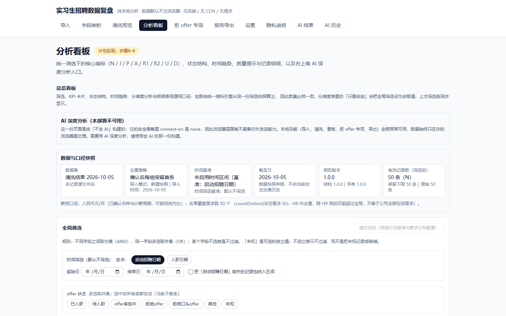
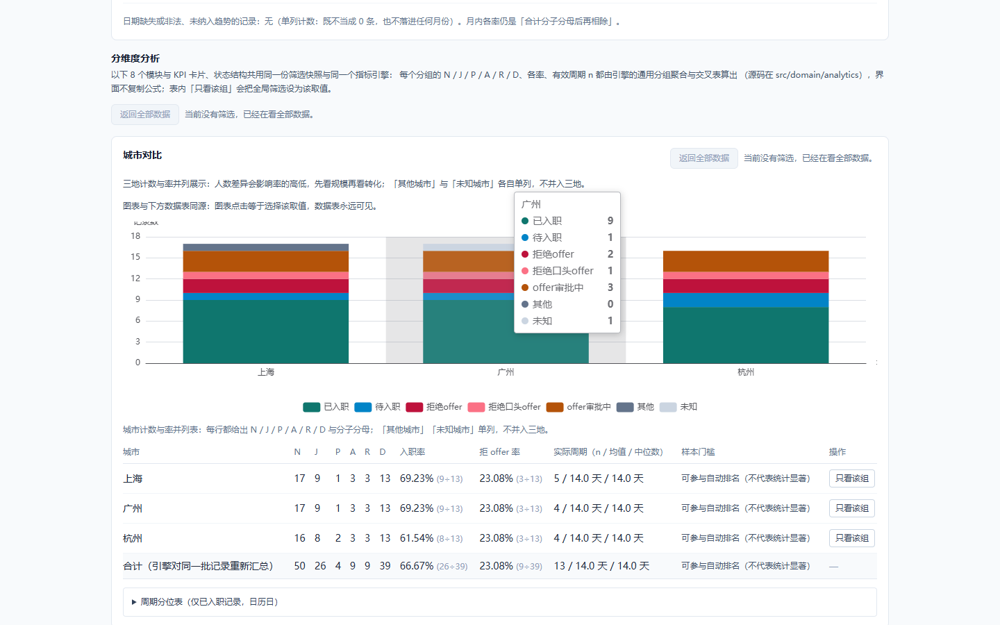
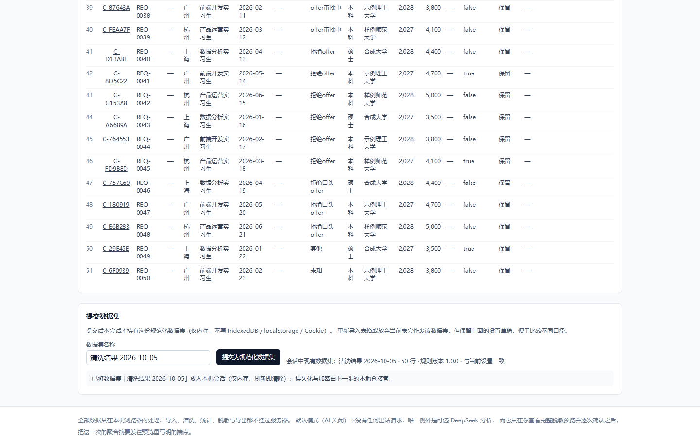

# 实习生招聘数据复盘（纯前端 · 默认本地）

一个**没有网站后端**的静态前端工具：把 offer 名单（Excel / CSV / TSV / 粘贴）在**你自己的浏览器里**
解析、清洗、统计、脱敏并导出报告。默认模式下**不产生任何出站请求**；唯一例外是可选的
「AI 深度分析」，它只在你查看完整脱敏预览并**逐次确认**之后，把**聚合摘要**发往 DeepSeek。

- 入口页面：导入 → 字段映射 → 清洗预览 → 分析看板 → 拒 offer 专项 → 报告导出 → 设置 / 隐私说明，
  外加 AI 结果与 AI 历史两页。
- 最高优先级约束写在 `AGENTS.md`；业务口径写在 `docs/PRD.md`；进度与逐步证据写在
  `docs/IMPLEMENTATION_PLAN.md`；每个决定的理由写在 `docs/DECISIONS.md`。

## 界面预览

以下截图全部来自 **`_demo/` 的合成演示数据**（50 行假数据），不含任何真实招聘信息；
生成方式见 `tests/e2e/portfolio-shots.spec.ts`（默认跳过，用 `PORTFOLIO_SHOTS=1` 触发）。

| 总览看板 | 分维度分析 | 清洗预览 |
|---|---|---|
|  |  |  |

## 它是什么、不是什么

| 是 | 不是 |
|---|---|
| offer 名单的**复盘**工具（N/J/P/A/R/D 与各率、周期、分位） | 全链路招聘漏斗（输入里没有投递 / 面试等前置环节） |
| 渠道 / HR **阶段表现**的对比 | 渠道 ROI（缺成本与全链路数据） |
| 本机加密存储 + 本地文件导出 | 云账号 / 跨设备同步 / 团队协作 |
| 可选的、逐次确认的 AI 摘要分析 | 「上传数据到服务器再分析」的在线服务 |

## 快速开始

### 只想用起来？双击 `启动本地版.bat`（推荐给不写代码的人）

在项目目录里**双击 `启动本地版.bat`**：它会检查 Node、必要时自动构建一次，
然后启动一个**只监听 127.0.0.1** 的本地小服务并自动打开浏览器
（`http://127.0.0.1:4173/`）。用法结束后**关掉那个黑窗口**服务就停了。

- 它使用的是 `scripts/serve-dist.mjs`：**零依赖**（只用 Node 内置模块），
  对着 `dist/`（或归档里的 `site/`）就能跑，不需要 `node_modules`。
- 必须用 `127.0.0.1` 这个地址打开：换成 `http://<你的IP>` 会让浏览器把页面当成不安全来源，
  「创建加密本地仓」会失效（Web Crypto 只在安全上下文里可用）。
- 这一份是**本地版（不含 AI）**：界面上不会出现 AI 入口，而是写明「本部署不可用」——
  因为产物自带的安全策略里 `connect-src` 是 `none`，它**在浏览器层面就没有出站能力**。

### 想改代码 / 参与开发

前置：**Node.js ≥ 20.19**（本项目在 Node v24.19.0 上开发与验证）。不需要 Git 也能运行，
但版本管理需要你自行安装。

```bash
npm install          # 安装依赖（锁文件已提交）
npm run dev          # 开发服务器（默认 http://localhost:5173）
npm run build        # 生产构建（本地版）→ dist/
npm run build:ai     # 含可选 AI 版的生产构建（CSP 精确放行官方端点）
npm run preview      # 本地预览 dist/
npm run typecheck    # tsc -b，无诊断
npm run lint         # oxlint，0 warning 0 error
npm test             # vitest run（单元 / 集成 / jsdom 交互，当前 1443 例 / 106 个文件）
npm run test:e2e     # 构建本地版后跑 Playwright 端到端（10 例；用系统 Chrome，不下载浏览器）
npm run test:e2e:ai  # 构建含 AI 版后跑 @ai-build 端到端（2 例，请求由用例本地应答）
```

### 想放到网上给同事用

跑 `npm run build`，然后把 **`_deploy/上传这个文件夹`** 拖到腾讯云 EdgeOne Pages
（<https://pages.edgeone.ai/zh/drop>，免费、自带 HTTPS）。完整步骤、备选方案与上线自检清单见
`deploy/tencent-edgeone.md`；要点是：**公开部署只用不含 AI 的本地版**，
并且**只上传那个文件夹**，不要把 `docs/`、源码、`_demo/` 一起传上去。

Windows PowerShell 若提示「禁止运行脚本」，用 `npm.cmd` / `npx.cmd` 调用（见 `AGENTS.md` §3）。
Vite 默认只绑定 `localhost`（本机解析为 IPv6 `::1`）；需要 IPv4 探测时加 `--host 127.0.0.1`。
Playwright 用 `channel: 'chrome'` 驱动**系统已安装的 Chrome**，因此**不需要** `npx playwright install`；
换 Edge 把配置里的 `channel` 改成 `'msedge'` 即可（本轮未跑，见 `docs/KNOWN_ISSUES.md`）。

想先看效果：`_demo/demo-intern-recruitment.tsv` 是**合成**演示数据（50 条，标准 21 列），
把它粘贴进「导入数据」页即可走完全流程。演示数据不含任何真实姓名 / 薪资 / HR / 学校。

## 数据口径速查（详见 PRD 第 6 章）

| 符号 | 含义 |
|---|---|
| N | 所有保留记录数（含审批中）——卡片名为「总 offer 记录数（含审批中）」 |
| J / P / A | 已入职 / 待入职 / offer 审批中 |
| R1 / R2 / R | 拒绝 offer / 拒绝口头 offer / R1 + R2 |
| U | 其他 / 未知 |
| D | 核心分母 = J + P + R（**排除**审批中、其他、未知） |
| 拒 offer 率 | R ÷ D ｜ 入职率 J ÷ D（**不得**用 J/N 冒充）｜ 审批中占比 A ÷ N（分母不同，界面明示） |

恒等式 `N = J + P + A + R1 + R2 + U`；汇总率一律**合并分子分母后再相除**，不平均各分组百分比。
缺失值一律显示「—」，**绝不**显示成 0；被抑制的小组（n < 5）显示「—」并说明原因。
所有指标只由 `src/domain/analytics` 的统一引擎计算，界面不复制公式。

## 隐私边界（一页版，权威说明见站内「隐私说明」页与 `PRIVACY.md`）

- **默认本地**：解析、清洗、统计、加密、导出全部在浏览器内完成，**数据默认不出浏览器**；
  不加载第三方脚本 / 在线字体 / 在线图片 / 地图 / 埋点 / 广告 / 遥测 / 错误上报，不接 CDN。
- **唯一出站例外**：可选的 DeepSeek 调用。默认关闭；打开开关、保存 Key、导入文件、切换筛选、
  打开历史都**不**产生请求；不探活、不查模型列表、不查余额。
- **逐次确认**：只有你在看板主动点「AI 深度分析」、看到完整脱敏预览（载荷 JSON、system 与 user
  消息、模型与参数、目的地址、脱敏级别、省略项、内容大小、费用上限估算）并确认后，才发出**这一次**请求。
  确认令牌只能消费一次；取消 / 失败 / 超时**不**自动重试、**不**换端点、**不**换模型、**不**排队。
- **发出去的只有聚合摘要**：不含原始行、姓名、候选人 / 需求 ID、HR 真名、学校全名、准确薪资、
  完整日期、文件名与逐条拒绝原因原文。岗位只出类别、学校只出层次、原因只出主题。
- **Key 只在本地**：默认仅内存，可显式加密保存到独立秘密槽位；只作为 `Authorization` 请求头发往
  已确认端点，不写入 URL、请求正文、源码、`VITE_*`、日志、普通备份或 AI 历史。
- **不承诺**：不声称「所有模式下绝不出站」、不声称供应商零保留、不承诺本地删除能撤回已发送内容、
  不承诺密码找回、不承诺导出文件已加密、不承诺脱敏后不可重新识别。CORS 可达性**不保证**。

## 本地仓（加密持久化）

- 临时模式（默认）：数据只在内存，刷新即失。
- 加密模式：创建本地仓（设置密码）后，数据集、清洗设置、映射模板、AI 偏好与 AI 历史以
  **AES-GCM-256** 密文写入本机 IndexedDB；密码经 **PBKDF2-HMAC-SHA-256** 派生，密码与密钥只在内存。
- 默认闲置 **15 分钟**自动锁定；刷新需重新解锁；**不提供密码找回**（只能用加密备份恢复或清空重建）。
- 四个删除动作**互不代替**，各自需要逐字输入短语：

| 动作 | 确认短语 | 删除 | 保留 |
|---|---|---|---|
| 清空业务数据 | `清空业务数据` | 数据集 / 清洗设置 / 映射模板 / 偏好 / AI 历史 | 仓密码与 AI Key |
| 删除 AI Key | `删除 AI Key` | 秘密槽位里的 Key | 业务数据与 AI 历史 |
| 清空 AI 历史 | `清空 AI 历史` | 仅 AI 历史 | 招聘数据与 Key |
| 清空整个本地仓 | `清空本地仓` | 整个数据库（含 Key 与历史） | 已下载的文件、同源其他应用 |

清除**不能**删除你已经下载到本机的文件，也**不会**碰同源其他应用的数据。

## 可选 AI 深度分析

1. 设置页打开 AI 开关（默认关闭；开关只是允许进入流程，**不是**永久授权）。
2. 填 API Key：默认只在内存；也可勾选「加密保存在本地仓」。
3. 选模型与参数：模型目录随版本打包（含核查日期与官方来源），不联网获取、不自动切换；
   不支持的参数在界面禁用而**不是**发出去被静默忽略；费用只给**上限估算**并写明假设。
4. 选脱敏级别：`strict`（总体 + 城市 + 房补类型）/ `standard`（默认）/ `custom`（只能在 standard
   白名单内收窄）。
5. **确认本地规则**：摘要里的岗位类别、学校层次与拒 offer 原因主题都来自本机规则（岗位类别映射、
   本地 GPT 名单与别名、原因字典）。确认绑定一份**指纹**，规则一改即失效，必须重新确认。
6. 看板点「AI 深度分析」→ 生成脱敏预览 → 逐字核对 → 确认 → 再次点击才发出这一次请求。
7. 结果页可安全渲染（不执行脚本、不加载远程图片）、复制净化后的 Markdown、导出 Markdown /
   打印版；**只有显式保存**才写入加密历史。

模型兼容、费用、Key、CORS 与供应商边界，以及「本地 / 自有代理」的显式配置边界（代理能看到 Key 与
摘要；改地址即撤销旧授权、不转发旧 Key；**本仓库不提供代理程序**），详见站内设置页与「隐私说明」页。

## 部署（静态托管：只准备配置，不擅自上线）

本项目只产出静态文件，**不要**为它添加 Functions / API 路由 / 云数据库 / CORS 代理，
也不要在托管平台上开启任何统计 / Analytics（页面因此不需要把 `script-src` 放宽到第三方域名）。

```bash
npm run build            # 本地版（默认）：connect-src 'none'，产物没有任何出站能力
npm run build:ai         # 含可选 AI 版：connect-src 精确放行 https://api.deepseek.com
npm run build:subpath    # 子路径示例：--base=/intern-recruitment/（换成你的路径）
npm run icons            # 重新生成 PWA 图标（纯 Node，无图片依赖）
```

### 两套 CSP（PRD 18.6）

| 项 | 本地版（`npm run build`） | 含可选 AI 版（`npm run build:ai`） |
|---|---|---|
| `connect-src` | `'none'` | 精确 `https://api.deepseek.com`（不是通配符、不是 `https:`） |
| `script-src` | `'self'`（无 `unsafe-inline` / 无 `unsafe-eval`） | 同左 |
| Service Worker | 只缓存应用壳与静态资源 | 同左；**不**缓存、**不**排队、**不**重发 AI 请求 |
| 外部字体 / CDN / 统计 | 禁止 | 禁止 |

- 策略字符串的唯一来源是 `src/lib/csp.ts`，构建时由 Vite 插件注入 **`index.html` 的 meta**
  与产物里的 **`_headers`**（Cloudflare Pages / Netlify 消费它）。实测：本地版两处都是
  `connect-src 'none'`，AI 版两处都是精确官方 origin；meta 排在 `<script>` / `<link>` **之前**
  （meta CSP 只对它之后的资源生效）。
- meta 版**比 `_headers` 版少一条 `frame-ancestors`**：`frame-ancestors` 通过 meta 下发时浏览器会
  忽略并打印一条控制台报错（步骤14 在真实 Chrome 里抓到），所以它只留在响应头版；
  点击劫持防护由响应头 CSP 与 `X-Frame-Options: DENY` 负责。
- **本仓库不放宽任意域**。要用自建代理只能显式给出**一个**精确 https origin：
  `CSP_MODE=ai CSP_CONNECT_SRC=https://your-proxy.example.com npm run build`
  （非法值直接让构建失败）。代理会看到你的 Key 与摘要，见 `PRIVACY.md`。

### Service Worker 与离线（PWA）

- `public/sw.js` 是**手写**的（不引 Workbox）：只缓存同源静态资源（导航页 + `/assets/*` + 图标 +
  manifest），缓存名带版本，升级只删旧版本的静态缓存。
- 它**明确不做**这些事（代码与测试逐条钉住）：不缓存非 GET（AI 调用是 POST）、不缓存跨源请求、
  不缓存带 `Authorization` 的请求、不使用 Background Sync / Periodic Sync / Push，
  也不读写 IndexedDB / localStorage / Cookie。
- **更新由你决定**：新版装好后停在等待状态，页脚上方提示「有新版本可用」，点「立即更新」才切换。
  刷新只换静态资源，**本机加密仓里的数据集、清洗设置与 AI 历史都不受影响**。
- 子路径部署时 SW 的作用域跟着 `base` 走（注册路径为 `<base>sw.js`）。

### 三个平台的差别（详见 `deploy/`）

| 平台 | 响应头 | 说明 |
|---|---|---|
| Cloudflare Pages | ✅ 读产物里的 `_headers` | 两套 CSP 都是**真响应头**；记得关掉 Rocket Loader 与 Web Analytics |
| Vercel | ✅ 用仓库根的 `vercel.json`（模板已给，与代码逐字一致） | 预览与生产用同一份策略 |
| GitHub Pages | ❌ 不能设响应头 | 只能靠 meta CSP；因此**建议只在这里部署本地版**（`connect-src 'none'`）。刷新不 404 是因为用了 HashRouter |

`deploy/README.md` 是索引，三份说明各自写清了子路径命令、缓存规则与关闭统计的要求。

**已验证（本机 + 真实 Chrome）**：三种构建命令都退出码 0；`vite preview` 下 `/` 返回 200 且带 meta CSP 与
manifest 链接、`/sw.js` 与 `/manifest.webmanifest` 可访问；子路径构建的产物前缀与 manifest 链接
都带 `/intern-recruitment/`；**Service Worker 在真实 Chrome 里真的装上并激活**（作用域
`http://127.0.0.1:4173/`），Cache Storage 里**只有**同源静态资源（应用壳 + `/assets/*`，
没有任何 AI 端点或跨源地址），`context.setOffline(true)` 后整页重载仍能打开应用壳与导入页，
manifest 与 192 图标可被取到。**未验证**：真实托管平台的响应头生效情况、
「添加到主屏幕」的真实安装、两个版本之间的更新提示与切换
（见 `docs/ACCEPTANCE.md` 的 A19 与 `docs/KNOWN_ISSUES.md`）。

## 验证与验收

**v1.3.4 已交付**（本轮：整理 + 一键启动 + 上线准备）：目录清掉了运行残留与过时文件
（`_checks/`、`test-results/`、`_demo/dev*.log`、过时的 `pnpm-lock.yaml`），6 份打包脚本合并成一份；
新增**双击即用**的 `启动本地版.bat`（配合零依赖的 `scripts/serve-dist.mjs`，只监听 127.0.0.1）；
**不含 AI 的产物不再显示 AI 入口**，而是写清「本部署不可用」及其原因（读页面自己的 meta CSP 判断，
见 D-102）；`deploy/tencent-edgeone.md` + `_deploy/上传这个文件夹` 用于腾讯云上线。

**v1.3.3 及更早版本保持冻结**：`intern-recruitment-v1.3.3-ai.zip`（AI 配置本会话兜底、打开清洗页不再作废数据集）、
`intern-recruitment-v1.3.2-ai.zip`（AI 报错分类与「正文为空」分情况诊断）、
`intern-recruitment-v1.3.1-ai.zip`（薪资默认口径、每模块一个「返回全部数据」、修掉打印窗口空白页）、
`intern-recruitment-v1.3.0-ai.zip`（图表分箱 / 降序 / 横竖方向）、
`intern-recruitment-v1.2.1-ai.zip`（4 项用户需求改造 + 导出闸门两个 bug）、v1.2.0 与 v1.1.0
均未被覆盖、哈希未变（逐版取代：v1.2.0 → v1.2.1 → v1.3.0 → v1.3.1 → v1.3.2 → v1.3.3 → v1.3.4）。
归档目录走 `.gitignore`，不进仓库；**待上传的部署包在 `_deploy/`（同样不进仓库）**。

- 自动化：`npm run typecheck` / `npm run lint` / `npm test` / `npm run build` 全部实跑通过，
  当前 **1443 例（106 个文件）**；另有 **Playwright 端到端 12 例**：`npm run test:e2e`（本地版 10 例）与
  `npm run test:e2e:ai`（含 AI 版 2 例，带 `@ai-build` 标签，在本地版产物上会**主动 skip** 而不是假装通过）。
- 真实浏览器已实测（系统 Chrome + `vite preview`）：整条本地链路（N=50 且恒等式成立）、
  默认零出站与页面内 `fetch` 被 CSP 拒绝、临时模式四类存储全空、建仓并解锁时仓内无明文哨兵、
  Service Worker 真的装上且断网可打开、AI 开开关 / 存 Key / 生成预览零请求且两次点击确认后恰好一次调用、
  Key 只出现在 `Authorization` 头、AI 结果面板内没有 `script` / `a` / `img` 节点，
  以及首屏与整条链路的性能数字（`docs/ACCEPTANCE.md` §0）。
- 逐条验收：`docs/ACCEPTANCE.md`（A01–A20 与 AI01–AI18，逐项标「已通过 / 部分通过 / 未验证」及证据）。
- 已知问题与未验证平台：`docs/KNOWN_ISSUES.md`。
- 未验证项照实写「未验证」：**没有部署到任何真实托管平台**（响应头是否生效、GitHub Pages 只有 meta CSP），
  也**没有用真实 Key** 做过任何付费请求——端到端用例里的官方端点响应（含 CORS 预检）由 `page.route` 本地合成，
  所以 **AI16「真实部署来源的直连」仍未验证**；`curl` 或 Node 请求成功**不等于**浏览器 CORS 通过。
  Edge / Firefox / WebKit 与移动端、PNG 真实像素 / PDF 中文与分页 / XLSX 在 Excel 中打开、
  PWA 的「添加到主屏幕」与两个版本之间的更新切换同样未验证。

## 文档索引

| 文件 | 内容 |
|---|---|
| `AGENTS.md` | 最高优先级的开发约束（网络 / 隐私 / 测试红线） |
| `docs/PRD.md` | 需求整理后的 PRD（业务口径以它为准） |
| `docs/IMPLEMENTATION_PLAN.md` | 步骤拆分与每步交付证据 |
| `docs/DECISIONS.md` | 决策记录（含每个真 bug 的修法与理由） |
| `docs/ACCEPTANCE.md` | A01–A20 / AI01–AI18 验收状态与证据 |
| `docs/RELEASE_v1.1.md` | **v1.1.0 交付说明**：构建命令、归档内容与校验、已实测项与未验证项、交付后待办 |
| `docs/RELEASE_v1.2.md` | **v1.2.0 / v1.2.1 交付说明**：4 项用户需求改造的口径与验收步骤、导出闸门两个 bug 的修正、归档校验、仍未验证项 |
| `docs/RELEASE_v1.3.md` | **v1.3.0 … v1.3.4 交付说明**：图表（分箱 / 降序 / 横竖方向）、第二轮反馈（薪资默认口径、每模块返回按钮、打印空白页）、AI 报错与空正文诊断、会话态与数据集两处 bug 的改法与验收步骤、归档校验、仍未验证项 |
| `docs/KNOWN_ISSUES.md` | 已知问题、未验证项与技术债 |
| `deploy/tencent-edgeone.md` | **腾讯云上线指南**（推荐 EdgeOne Pages 拖拽上传）：步骤、备选路线、上线 5 项自检、红线 |
| `scripts/serve-dist.mjs` | 本地版一键启动用的**零依赖**静态服务器（配合根目录的 `启动本地版.bat`） |
| `PRIVACY.md` | 隐私说明（用户可见版） |
| `_demo/README.md` | 合成演示数据的使用方式 |
